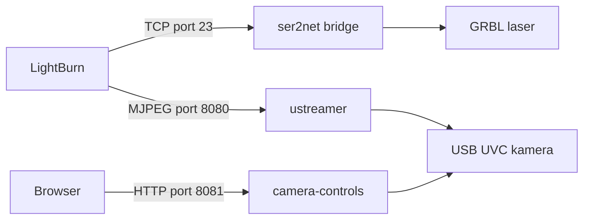

# PiFalcon

[](https://github.com/maly/pifalcon/actions/workflows/ci.yml)

PiFalcon zpřístupní laser s řadičem GRBL a USB kameru přes Raspberry Pi v lokální síti. LightBurn se k laseru připojuje přes TCP, obraz kamery čte jako MJPEG stream a samostatné webové rozhraní umožňuje měnit parametry kamery bez přístupu přes SSH.

Projekt je připravený pro Raspberry Pi OS Lite a byl ověřen na Raspberry Pi 3 Model B s kamerou Creality Falcon.

## Co řešení poskytuje

| Služba | Adresa | Účel |
|---|---|---|
| `laser-bridge.service` | `gravipi.local:23` | Převod TCP komunikace na sériový port laseru pomocí `ser2net` |
| `camera-stream.service` | `http://gravipi.local:8080/stream` | MJPEG stream USB kamery pomocí `ustreamer` |
| `camera-controls.service` | `http://gravipi.local:8081/` | Webové ovládání dostupných V4L2 parametrů kamery |

Adresu `gravipi.local` lze nahradit IP adresou Raspberry Pi.

### Zapojení služeb



## Dokumentace

- [HOWTO.md](HOWTO.md) — kompletní návod pro nové Raspberry Pi včetně instalace balíčků, vytvoření služeb a ověření;
- [`camera/`](camera/) — zdrojové soubory webového ovládání kamery, testy, systemd unit a výchozí konfigurace.

Pro novou instalaci začněte dokumentem [HOWTO.md](HOWTO.md). Cesty v `/dev/serial/by-id/` a `/dev/v4l/by-id/` vždy nahraďte cestami skutečně zjištěnými na cílovém Raspberry Pi.

## Požadavky

- Raspberry Pi s Raspberry Pi OS Lite a přístupem přes SSH;
- laser s řadičem GRBL připojený přes USB;
- USB UVC kamera;
- `ser2net`, `ustreamer`, `v4l-utils`, Python 3, Flask a Gunicorn;
- LightBurn a webový prohlížeč ve stejné lokální síti.

## Webové ovládání kamery

Aplikace v adresáři [`camera`](camera/) načítá parametry přímo z `v4l2-ctl`, takže zobrazuje pouze prvky podporované připojenou kamerou. Podporuje číselné, přepínací i výběrové controls, kontroluje přípustné hodnoty a po změně znovu načte skutečný stav zařízení.

Přístup je ve výchozím nastavení omezen na loopback a privátní IPv4 sítě proměnnou `ALLOWED_NETWORKS`. Měnící požadavky (`POST`/`PUT`/`DELETE`) navíc musí mít `Origin` shodný s hostitelem aplikace (nebo `Content-Type: application/json` / hlavičku `X-Requested-With: camera-controls`) a hlavička `Host` musí patřit do `ALLOWED_HOSTS` (výchozí: hostitel z `CAMERA_STREAM_URL`, `localhost`, `127.0.0.1` a IP adresy z `ALLOWED_NETWORKS`), což chrání proti CSRF a DNS rebindingu. Konfigurace nasazení je v [`camera/camera-controls.default`](camera/camera-controls.default).

Testy aplikace se spouštějí v čistém virtualenvu takto (závislosti jsou v [`camera/requirements-dev.txt`](camera/requirements-dev.txt)):

```bash
python3 -m venv .venv && . .venv/bin/activate
pip install -r camera/requirements-dev.txt
cd camera
python -m pytest -q
```

Stejné testy běží v GitHub Actions (workflow [CI](.github/workflows/ci.yml)) na každém pull requestu a pushi do `master`. Na Raspberry Pi se Gunicorn instaluje přes `apt` (viz [HOWTO.md](HOWTO.md)), proto není v `requirements.txt`.

## Ověření provozu

Po instalaci zkontrolujte stav služeb:

```bash
systemctl is-active laser-bridge.service camera-stream.service camera-controls.service
```

Potom ověřte webové endpointy:

```bash
curl -fsS http://127.0.0.1:8081/api/controls
curl -fsS -o /tmp/camera-test.jpg http://127.0.0.1:8080/snapshot
```

Podrobnější kontroly, diagnostiku a logy obsahuje [HOWTO.md](HOWTO.md#8-ověření-výsledku).

## Bezpečnost

Služby jsou určené pouze pro důvěryhodnou lokální síť. Porty `23`, `8080` a `8081` nepřesměrovávejte z routeru do internetu. Přístup k nim (a k SSH) je navíc přímo na Raspberry Pi omezen povinným firewallem `nftables` jen na loopback a privátní LAN rozsahy – viz [HOWTO.md – Omezení přístupu k portům](HOWTO.md#7-omezení-přístupu-k-portům-povinné).

Služby `laser-bridge` (`ser2net`) a `camera-stream` (`ustreamer`) neběží jako root, ale pod dočasným neprivilegovaným uživatelem (`DynamicUser=yes`) s přístupem jen ke skupině `dialout`, resp. `video`; konfigurace `ser2net` se generuje do `/run/laser-bridge/`. Bridge používá `kickolduser: false`: dokud je připojený LightBurn, každé další spojení na port `23` je odmítnuto a běžící úloha se nepřeruší. Uvízlé spojení uvolní `sudo systemctl restart laser-bridge.service`. Před přímým testováním GRBL přes TCP proto odpojte LightBurn.
